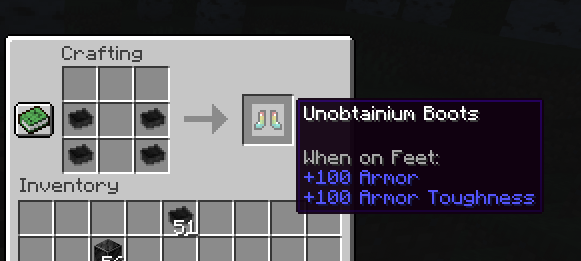

# Unobtainium Armor

A quick little project designed to get my feet wet with Minecraft
modding.

The initial goal was simple:

- Add "Unobtainium Armor" to Minecraft 1.18.1

To make this mod even simpler,

- The Unobtainium itself came from an existing 1.18 mod,
[Mythic Metals](https://www.curseforge.com/minecraft/mc-mods/mythicmetals)

- The Unobtainium armor texture came from an old (1.12 Forge) mod,
[Extended Items and Ores](https://www.curseforge.com/minecraft/mc-mods/extended-items-and-ores-mod)

which left me with nothing to do except follow [some tutorials](https://fabricmc.net/wiki/tutorial:armor).

For the fun of it, I've made Unobtainium armor give _super powerful_ protection, but
then nerfed it to have extremely low durability.

This mod absolutely requires Fabric. It is extremely unlikely I will make a version
for Forge. That being said, I'll probably update this mod to 1.19 once the rest of the
mods my family relies on are upgraded.

## Setup and Use

1. Install Minecraft 1.18.1, Fabric and the Fabric API
2. Install the [Mythic Metals](https://www.curseforge.com/minecraft/mc-mods/mythicmetals)
   mod for 1.18.1 along with all its dependencies.
3. Install the [BetterEnd mod](https://www.curseforge.com/minecraft/mc-mods/betterend) for 1.18 and the corresponding 
   version of [BCLib](https://www.curseforge.com/minecraft/mc-mods/bclib).
3. Download this mod from the [release page](https://github.com/OpenBagTwo/UnobtainiumArmor/releases)
   and drop it into your mods folder.
4. Get yourself some unobtainium and get crafting!

## Credits

Unobtainium Armor textures are taken from
[lElChiel](https://www.curseforge.com/members/lelchiel)'s
[Extended Items and Ores](https://www.curseforge.com/minecraft/mc-mods/extended-items-and-ores-mod)
mod for 1.12.

100% of the credit for the Unobtainium itself goes to
[@Noaaan](https://github.com/Noaaan) for
the [Mythic Metals](https://github.com/Noaaan/MythicMetals)
mod.

Some assets have also been adapted from the mods
[SilentGems](https://github.com/SilentChaos512/SilentGems) by
[SilentChaos512](https://github.com/silentchaos512)
and
[MoreGems](https://www.curseforge.com/minecraft/mc-mods/more-gems-fabric) by
[kwpugh](https://github.com/kwpugh).

Mythril Armor Model and Textures are taken from [Modding by Kaupenjoe](https://www.youtube.com/c/TKaupenjoe)'s
[tutorial on Fabric modding using Geckolib](https://github.com/Tutorials-By-Kaupenjoe/Fabric-Tutorial-1.18.1).

All code conventions and project structure are courtesy of 
Fabric's excellent [modding tutorials](https://fabricmc.net/wiki/tutorial:armor)
and [example repos](https://github.com/gdude2002/Gilded-Netherite).

I also used [MCreator](https://mcreator.net/) to generate sets of
armor textures.

## License

Any code in this mod that is not adapted
[directly from the Fabric mod template](https://github.com/FabricMC/fabric-example-mod)
or otherwise specified **is licensed under [GPLv3](https://www.gnu.org/licenses/gpl-3.0.en.html)**.

### Unobtainium Armor texture
sUnobtainium Armor textures are taken from
[lElChiel](https://www.curseforge.com/members/lelchiel)'s
[Extended Items and Ores](https://www.curseforge.com/minecraft/mc-mods/extended-items-and-ores-mod)
mod and are used under the following terms:

> _Also, if you wish to add this to a mod-pack or anything,
> feel free to do so as I have seen it in some
> and I wanted to make it clear that I do not mind.
> My only request is that the mod is not replicated
> and published as though you are the author,
> putting it in a mod-pack or in any other way is fine,
> just do not claim it as your own._

### Mythril Armor Models, Textures and Implementations
Kaupenjoe's assets and source code (basically anything having to do with Mythril Armor) are provided
under the MIT license:

> MIT License
>
> Copyright (c) 2021 Tutorials By Kaupenjoe
>
> Permission is hereby granted, free of charge, to any person obtaining a copy
of this software and associated documentation files (the "Software"), to deal
in the Software without restriction, including without limitation the rights
to use, copy, modify, merge, publish, distribute, sublicense, and/or sell
copies of the Software, and to permit persons to whom the Software is
furnished to do so, subject to the following conditions:
>
> The above copyright notice and this permission notice shall be included in all
copies or substantial portions of the Software.
>
> THE SOFTWARE IS PROVIDED "AS IS", WITHOUT WARRANTY OF ANY KIND, EXPRESS OR
IMPLIED, INCLUDING BUT NOT LIMITED TO THE WARRANTIES OF MERCHANTABILITY,
FITNESS FOR A PARTICULAR PURPOSE AND NONINFRINGEMENT. IN NO EVENT SHALL THE
AUTHORS OR COPYRIGHT HOLDERS BE LIABLE FOR ANY CLAIM, DAMAGES OR OTHER
LIABILITY, WHETHER IN AN ACTION OF CONTRACT, TORT OR OTHERWISE, ARISING FROM,
OUT OF OR IN CONNECTION WITH THE SOFTWARE OR THE USE OR OTHER DEALINGS IN THE
SOFTWARE.